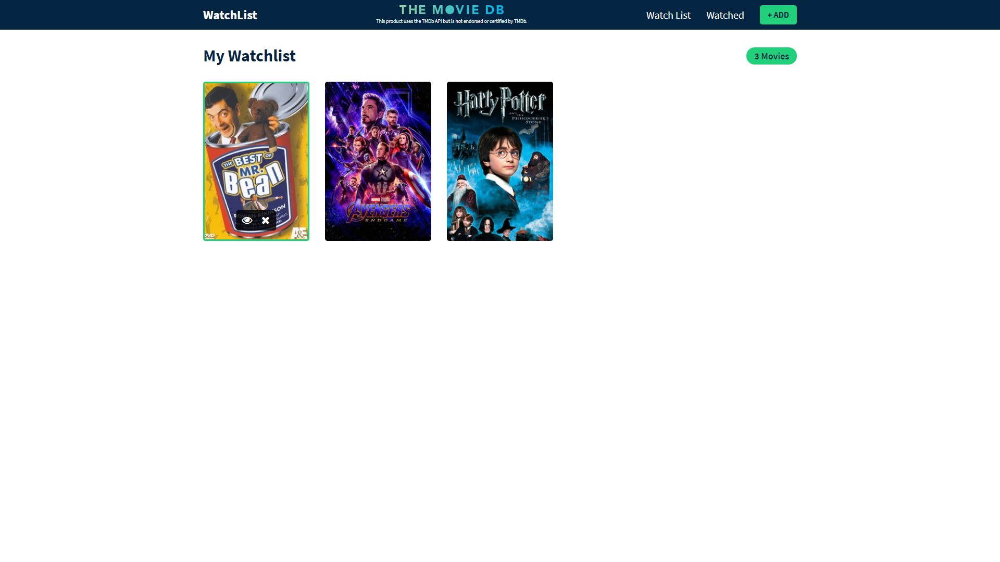

# TMDB Movie Watchlist

https://tmdb-movie-watchlist.netlify.app/

## Description

You can add movie to a watchlist. After watching that movie you can move that item to the watched list. The movie data is provided by TMDB API (This product uses the TMDb API but is not endorsed or certified by TMDB). Created using React JS.

## Source

Create a Movie Watchlist with React Hooks, Context API and localStorage Tutorial by Matt The Dev [(YouTube)](https://www.youtube.com/watch?v=1eO_hNYzaSc) [(GitHub)](https://github.com/MattDobsonWeb/movie-watchlist-react) with some modifications.
